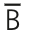
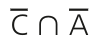
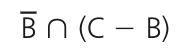

## 1 - Dados os conjuntos A = { 1, 2, 3, 4 }, B = { 3, 4, 5, 6, 7 } e U = { 0, 1, 2, 3, 4, 5, 6, 7, 8, 9 }, detarminar:


```
  A) { 0, 1, 2, 5, 6, 7, 8, 9 }
```

```
  B) { 0, 5, 6, 7, 8, 9 } ∪ { 0, 2, 8, 9 } = { 0, 2, 5, 6, 7, 8, 9 }
```

## 2 - Dados os conjuntos A = { a, b, c }, B = { a, c, d, e }, C = { c, d }, D = { a, d, e }, verdadeiro ou falso:

| Afirmação                   | Resposta |
| --------------------------- | -------- |
| A - B = { b }               | V        |
| B - C = { a, e }            | V        |
| D - B = { c }               | F        |
| ∁ca = ∅                     | F        |
| ∁∅b = { a, c, d, e }        | V        |
| ∁db = { c }                 | V        |
| (A ∩ B) - D = { a, d, e }   | F        |
| B - (A ∪ C) = { e }         | V        |
| (∁cd) ∪ (∁db) = { a, c, e } | V        |

**Explicação de Cca = ∅ (f): C ⊄ A, logo não se define, Cca seria ∅ se C = A**

## 3 - Dados os conjuntos A = { 2, 4, 8, 12, 14 }, B = { 5, 10, 15, 20, 25 }, C = { 1, 2, 3, 18, 20 }, determinar:

### a) A - C

    { 4, 8, 12, 14 }

### b) B - C

    { 5, 10, 15, 25 }

### c) (C - A) ∩ (B - C)

    { 1, 3, 18, 20 } ∩ { 5, 10, 15, 25 }
    ∅

### d) (A - B) ∪ (C - B)

    { 2, 4, 8, 12, 14 } ∩ { 1, 2, 3, 18 }
    { 2 }

## 4 - Dados os conjuntos A = { 1, 2, 3, 4 }, B = { 4, 5 } e C = { 3, 4, 5, 6, 7 }, determinar número de subconjuntos de (A - B) ∩ C:

    { 1, 2, 3 } ∩ c
    { 3 }
    ∅ e { 3 }
    2

## 5 - Considerando o conjunto universo U = { -2, -1, 0, 1, 2, 3, 4, 5 } e dados A = { x ∈ U | x ≤ 3 }, B = { x ∈ U | x é impar } e C = { x ∈ U | -2 ≤ x < 1 }, determinar:

A = { -2, -1, 0, 1, 2, 3 }
B = { -1, 1, 3, 5 }
C = { -2, -1, 0 }

### a) A ∩ B

    { -1, 1, 3 }

### b) A ∪ C

    { -2, -1, 0, 1, 2, 3 }

### c) A - C

    { 1, 2, 3 }

### d) C - B

    { -2, 0 }

### e) ∁ca

    { 1, 2, 3 }

### f) ∁ab

    A ⊄ B, logo não se define

### g) 

    { -2, 0, 2, 4 }

### h) (A ∩ C) - B

    { -2, -1, 0 } - { -1, 1, 3, 5 }
    { -2, 0 }

### i) C ∪ (A - B)

    { -2, -1, 0 } ∪ { -2, 0, 2 }
    { -2, -1, 0, 2 }

### j) (A - B) ∪ (B - A)

    { -2, 0, 2 } ∪ { 5 }
    { -2, 0, 2, 5 }

### k) 

    { 1, 2, 3, 4, 5 } ∩ { 4, 5 }
    { 4, 5 }

### i) 

     { -2, -1, 0, 2, 4 } ∩ { -2, 0 }
     { -2, 0 }

### j) Dados os conjuntos A = { 1, 2, 3, 4, 5 }, B = { 1, 2, 4, 6, 8 } e C = { 2, 4, 6, 7 }, obter conjunto X tal que X ⊂ A e A - X = B ∩ C.

    B ∩ C = { 2, 4, 6 }
    A - X = { 2, 4, 6 }
    A - { 2, 4, 6 } = X
    { 1, 2, 3, 4, 5 } - { 2, 4, 6 } = { 1, 3, 5 }
    X = { 1, 3, 5 }

## 6 - Sejam A e B subconjuntos de um conjunto U. Se U tem 35 elementos, A tem 20 elementos, A ∩ B tem 6 elementos e A ∪ B tem 28 elementos, determinar o número de elementos dos conjuntos:

| Conjunto                    | Resposta |
| --------------------------- | -------- |
| B                           | 14       |
| A - B                       | 14       |
| B - A                       | 8        |
| U - A                       | 15       |
| U - B                       | 21       |
| U - (A ∩ B)                 | 29       |
| U - (A - B)                 | 21       |
| (U - A) ∩ (U - B)           | 7        |

**Explicação de (U - A) ∩ (U - B): para que haja a Interseção de um elemento entre as diferenças entre os dois conjuntos e o conjunto universo, ambos não devem conter o elemento, sendo assim:** <br>

    R = U - (A ∪ B)
    R = 35 - 28
    R = 7 

## 7 - Determinar A ∩ B e A ∪ B, sendo: 
N = conjunto dos números naturais <br>
Z = conjunto dos números inteiros <br>
N* = conjunto dos números naturais não nulos

a) A = { x ∈ N | x ≥ 5 } e B = { x ∈ N | x < 7 } 

        A ∩ B = { 5, 6 }
        A ∪ B = N

b) A = { x ∈ Z | x > 1 } e B = { x ∈ Z | x ≥ 3 }

        A ∩ B = B
        A ∪ B = A

C) A = { x ∈ Z | x < 10 } e B = { x ∈ N* | x < 6 }

        A ∩ B = B
        A ∪ B = A

D) A = { x ∈ N | 2 < x ≤ 5 } e B = { x ∈ Z | 1 ≤ x < 4}

        A n B = { 3 }
        A ∪ B = { 1, 2, 3, 4, 5 }


## 8 - Provar afirmações com demonstrações
### a) Se A e B são números inteiros ímpares, a soma resulta em um número par
        a + b = (p * 2 + 1) + (q * 2 + 1) => 2 * (p + q + 1)
        verdadeiro

### b) Se A é um número inteiro par, então A² é um número par
        a² = (p * 2) * (p * 2) => p² * 4 => p² * 2 * 2 => 2p² * 2
        verdadeiro

### c) Se A é um número inteiro múltiplo de 6, então A é um múltiplo de 3
        a = 6p = p * 2 * 3 = 2p * 3
        verdadeiro

### d) Se A é um inteiro divisível por 5, então A é divisível por 10
        falso, 5 é divisível por 5, mas não por 10

### e) Se A, B e C são números inteiros consecutivos, a soma dos 3 gera um número inteiro múltiplo de 3
        A + B + C = p + p + 1 + p + 2 = 3p + 3 = (p + 1) * 3

### f) Se A e B são números inteiros consecutivos A² + B² é um número impar
        A² + B² = p² + (p + 1)² = p² + p² + 2p + 1 = 
        A = 4
        265
        41