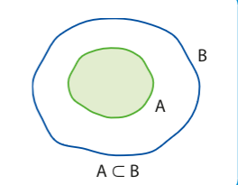
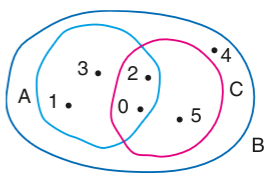

# Conjuntos

- **Conjunto**: o conjunto é designado por uma letra maiúscula (A, B, C)
- **Elemento**: designado por uma letra minúscula (a, b, c)
- **Pertinência**: relação entre o elemento e o conjunto

Se P é o conjunto das minhas grandes paixões, l (Lara), e (Leyna) e m (Mayara) são elementos desse conjunto, o qual pode ser representado por 

P = { l, e, m }

Pode-se dizer então que l ∈ P, e ∈ P e m ∈ P

Pode-se designar um conjunto por uma propriedade característica de seus elementos, ex:

p = { l | l é o nome da doce Lara }

"|" pode ser lido como "tal que"

## Igualdade de conjuntos

Dois conjuntos são iguais de todo elemento de A pertence a B e vice versa.

se P = { l, e, m } e B = { e, m, l } temos que P = B;  
se P = { l | 2 * 4 = l } e B = { 8 } temos que P = B

## Tipos de conjunto

- **Conjunto unitário**:   
C = { lara }
P = { l | l possui um bela traseira } = { lara }
- **Conjunto vazio**:  
C = Conjunto de defeitos naquele lindo corpo daquela desgraçada = ∅  
C = { a | a ≠ a } = ∅

Há conjuntos cujo os elementos são conjuntos  
P = {{lara}, ∅}

Assim temos:  
∅ ∈ P, {lara} ∈ P  
lara ∉ P pois lara ≠ {lara}

[Exercícios](./cases/1.md)

## Subconjuntos

Condiderando o conjunto A = { x | x = é letra do meu grande amor de infância } e B = { x | é letra da palavra laura }, ou seja  
A = { l, a, r } e |B = { l, a, u, r }  

Todo elemento A também é um elemento B, A é um subconjunto de B (A ⊂ B).  
B contém A (B ⊃ A).

## Propriedades da relação de inclusão

Independente de quais forem os conjuntos A, B, e C, é correto afirmar que: 
  - ∅ ⊂ A
  - A ⊂ A
  - Se A ⊂ B e B ⊂ C, A ⊂ C
  - Se A ⊂ B e B ⊂ A, A = B

Dados A = { 0, 1, 2, 3 }, B = { 0, 1, 2, 3, 4, 5 } e C = { 0, 2, 5 }
  - A ⊂ B, pois todo elemento de A pertence a B
  - C ⊄ A, pois 5 ∈ C e 5 ∉ A
  - B ⊃ C, pois todo elemento de C pertence a B
  - B ⊄ A, pois 4 ⊂ B e 4 ⊄ A e também 5 ⊂ B e 5 ⊄ A

  

Dados A = ∅, B = { a }, C = { a, b } e D = { a, b, c } os respectivos subconjuntos de cada são:
  - A: ∅
  - B: ∅, { a }
  - C: ∅, { a }, { b }, { a, b }
  - D: ∅, { a }, { b }, { c }, { a, b }, { a, c }, { b, c }, { a, b, c }

**Se um conjunto tem X elementos, ele tem 2 elevado a X subconjuntos.**

## Conjunto das partes
Para expressar o conjunto de contém todos os subconjuntos de um outro conjunto, usamos P(conjunto).  
Dado A = { 1, 2, 3 }  
Conjuntos das partes de A = P(A)  
P(A) = { ∅, { 1 }, { 2 }, { 3 }, { 1, 2 }, { 1, 3 }, { 2, 3 }, { 1, 2, 3 } }

[Exercícios](./cases/2.md)

## Interseção e reunião
A interseção de dois conjuntos é um conjunto com os seus elementos em comum. 

Dato A = { 1, 2, 3 } e B = { 2, 3, 4 }  
A ∩ B = { x | x ∈ A e x ∈ B }  
A ∩ B = { 2, 3 }

**N(conjunto) é usado para indicar a quantidade de elementos distintos em um conjunto**  
  sendo assim: n(A ∩ B) = 2

Dados dois conjuntos quaisquer X e Z:  
  - Se X ⊂ Z, X ∩ Z = X
  - Se X ⊃ Z, X ∩ Z = Z
  - Se X e Z não tem elementos em comum, X ∩ Z = ∅

## União
A junção de dois conjuntos

Dado A = { 1, 2, 3 } e B = { 2, 3, 4 }
A ∪ B = { x | x ∈ A ou x ∈ B }
A ∪ B = { 1, 2, 3, 4 }

Dados dois conjuntos quaisquer X e Z:  
  - Se X ⊂ Z, X ∪ Z = Z
  - Se X ⊃ Z, X ∪ Z = X
  - Se X ∩ Z = ∅, n(X ∪ Z) = n(X) + n(Z)
  - Se X ∪ Y = ∅, X = ∅ e Y = ∅
  - X ⊂ (X ∪ Y) e Y ⊂ (X ∪ Y)
  - n(X ∪ B) = n(X) + n(B) - n(X ∩ B)

[Exercícios](./cases/3.md)